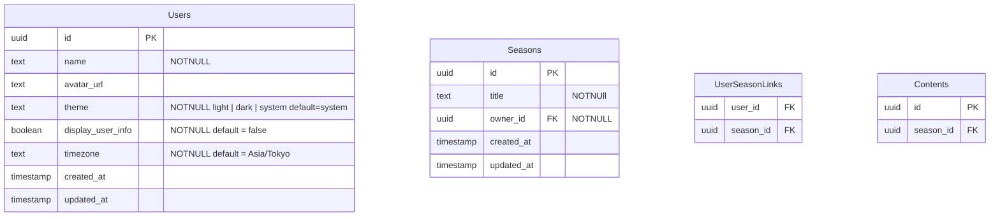

# 略

- null許容
  - NN = NOT NULL
  - NA = Nullable
- d = defalut

# ER図

```mermaid
erDiagram
    Users {
        uuid id PK
        text name "NOTNULL"
        text avatar_url
        text theme "NOTNULL light | dark | system default=system"
        boolean display_user_info "NOTNULL default = false"
        text timezone "NOTNULL default = Asia/Tokyo"
        timestamp created_at
        timestamp updated_at
    }
    Seasons {
        uuid id PK
        text title "NOTNUll"
        uuid owner_id FK "NOTNULL"
        timestamp created_at
        timestamp updated_at
    }
    UserSeasonLinks {
        uuid user_id FK
        uuid season_id FK
    }
    Contents {
        uuid id PK
        uuid season_id FK
    }
```
