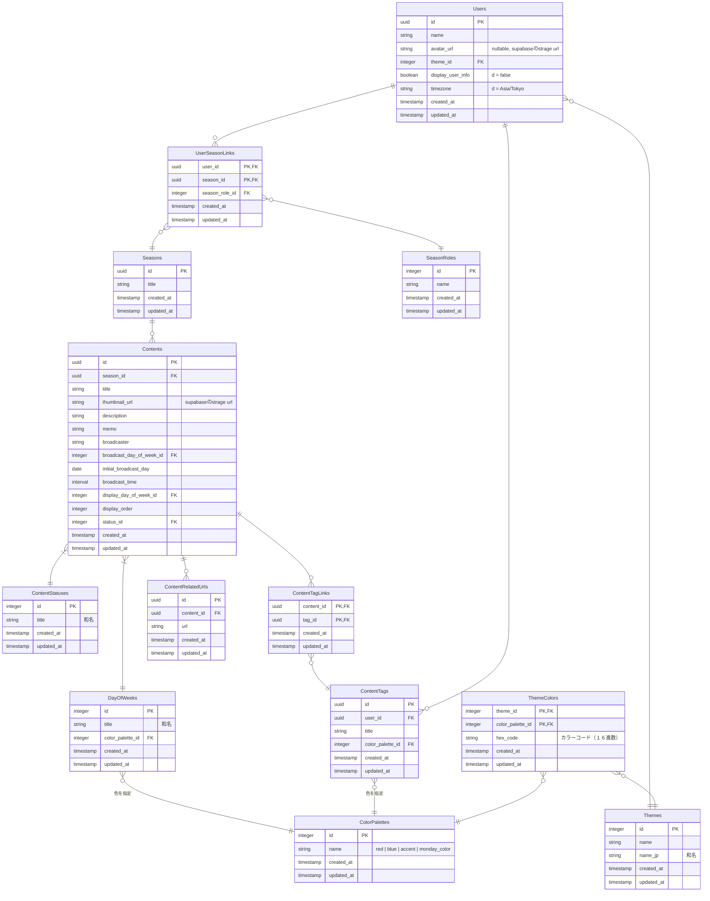

# 前提

基本的にNotNull, 必須
defaultはdと省略

# ER図

```mermaid
erDiagram
    Users ||--o{ UserSeasonLinks : ""
    Users }o--|| Themes: ""
    UserSeasonLinks }o--|| Seasons: ""
    UserSeasonLinks }o--|| SeasonRoles: ""
    Seasons ||--o{ Contents: ""
    Contents }|--|| DayOfWeeks: ""
    Contents }|--|| ContentStatuses: ""
    Contents ||--o{ ContentTagLinks: ""
    Contents ||--o{ ContentRelatedUrls: ""
    ContentTagLinks }o--|| ContentTags: ""
    Users ||--o{ ContentTags: ""
    DayOfWeeks }o--|| ColorPalettes : "色を指定"
    ContentTags }o--|| ColorPalettes : "色を指定"
    ThemeColors }o--|| ColorPalettes : ""
    ThemeColors }o--|| Themes : ""

    Users {
        uuid id PK
        string name
        string avatar_url "nullable, supabaseのstrage url"
        integer theme_id FK
        boolean display_user_info "d = false"
        string timezone "d = Asia/Tokyo"
        timestamp created_at
        timestamp updated_at
    }
    Themes {
        integer id PK
        string name
        string name_jp "和名"
        timestamp created_at
        timestamp updated_at
    }
    Seasons {
        uuid id PK
        string title
        timestamp created_at
        timestamp updated_at
    }
    UserSeasonLinks {
        uuid user_id PK,FK
        uuid season_id PK,FK
        integer season_role_id FK
        timestamp created_at
        timestamp updated_at
    }
    SeasonRoles {
        integer id PK
        string name
        timestamp created_at
        timestamp updated_at
    }
    Contents {
        uuid id PK
        uuid season_id FK
        string title
        string thumbnail_url "supabaseのstrage url"
        string description
        string memo
        string broadcaster
        integer broadcast_day_of_week_id FK
        date initial_broadcast_day
        interval broadcast_time
        integer display_day_of_week_id FK
        integer display_order
        integer status_id FK
        timestamp created_at
        timestamp updated_at
    }
    ContentRelatedUrls {
        uuid id PK
        uuid content_id FK
        string url
        timestamp created_at
        timestamp updated_at
    }
    DayOfWeeks {
        integer id PK
        string title "和名"
        integer color_palette_id FK
        timestamp created_at
        timestamp updated_at
    }
    ContentStatuses {
        integer id PK
        string title "和名"
        timestamp created_at
        timestamp updated_at
    }
    ContentTagLinks {
        uuid content_id PK,FK
        uuid tag_id PK,FK
        timestamp created_at
        timestamp updated_at
    }
    ContentTags {
        uuid id PK
        uuid user_id FK
        string title
        integer color_palette_id FK
        timestamp created_at
        timestamp updated_at
    }
    ThemeColors {
        integer theme_id PK,FK
        integer color_palette_id PK,FK
        string hex_code "カラーコード（１６進数）"
        timestamp created_at
        timestamp updated_at
    }
    ColorPalettes {
        integer id PK
        string name "red | blue | accent | monday_color"
        timestamp created_at
        timestamp updated_at
    }
```
